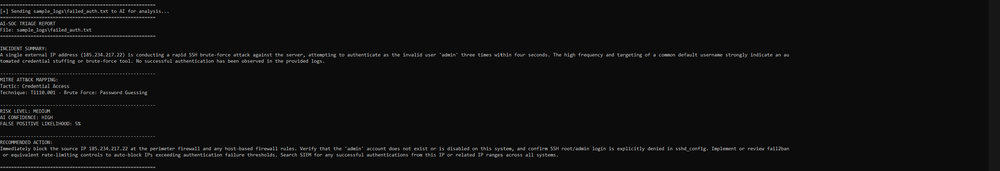

# AI-Powered SOC Triage System

Automates security log analysis using AI to detect threats, map activity to MITRE ATT&CK, enrich alerts with IP intelligence, and generate SOC-style incident response actions.

## 🔎 SOC Triage Demo

### 🖥️ Terminal Analysis Output


### 🚨 Slack Alret Output


## Features
- AI-assisted log triage
- MITRE ATT&CK mapping
- Risk scoring and confidence levels
- Batch processing for multiple log scenarios
- Automated incident response recommendations
- Slack alerting for HIGH and CRITICAL incidents
- IP enrichment with geolocation, ASN/organization, hosting, and proxy context
- SOC case tracking with Incident ID, timestamp, and status

## 💡 Why This Matters

This project simulates a real SOC workflow by:
- Reducing alert fatigue through automated triage
- Mapping raw security events to MITRE ATT&CK techniques
- Prioritizing threats based on severity and confidence
- Enriching alerts with external IP context
- Generating actionable response steps for analysts

This reflects how modern SOC teams investigate, prioritize, enrich, and respond to security incidents.

## Detection Capabilities

| Scenario | Risk | MITRE ATT&CK Mapping |
|----------|------|----------------------|
| Failed SSH authentication | MEDIUM | T1110.001 - Brute Force: Password Guessing |
| Lateral movement | HIGH | T1078 - Valid Accounts |
| Data exfiltration | HIGH | T1048.002 - Exfiltration Over Encrypted Non-C2 Protocol |
| Malware execution | CRITICAL | T1059.004 - Unix Shell |
| Privilege escalation | CRITICAL | T1548.003 - Sudo and Sudo Caching |

## 🔍 Threat Enrichment

The system enriches detected public IP addresses with additional context, including:

- Enriched IP address
- City and country
- ASN and organization
- Hosting and proxy indicators

This enrichment appears directly in Slack alerts and JSON alert output to support faster analyst decision-making.

## 🧾 SOC Case Tracking

HIGH and CRITICAL alerts include SOC-style case metadata:

- Incident ID
- Timestamp
- Status: OPEN
- Source file
- Risk level
- MITRE technique
- Confidence score
- False positive likelihood

This makes each alert easier to track, document, and discuss during incident response workflows.

## 🔔 Slack Alerting

The project sends formatted Slack alerts for HIGH and CRITICAL incidents to simulate SOC alert routing.

Slack alerts include:

- Incident ID
- Status
- Timestamp
- Risk level
- MITRE ATT&CK technique
- Source file
- Threat enrichment context
- Recommended response action

## 🚀 How to Run

### 1. Clone the Repository
```bash
git clone https://github.com/angelopollari187-hub/ai-soc-triage.git
cd ai-soc-triage
```
### 2. Install Dependencies
```bash
pip install -r requirements.txt
```
### 3. Configure Environment Variables
```bash
ANTHROPIC_API_KEY=your_api_key_here
SLACK_WEBHOOK_URL=your_slack_webhook_url_here
```
### 4. Run a Single Log
```bash
python triage.py --log sample_logs/failed_auth.txt --save --json
```
### 5. Run Batch Processing
```bash
python triage.py --batch sample_logs/ --save --json
```
## 🧪 Example Output
```bash
AI-SOC TRIAGE REPORT
File: sample_logs/malware_exec.txt

INCIDENT SUMMARY:
A suspicious systemd service was started, downloaded a shell script from a suspicious external IP, made it executable, and ran it.

MITRE ATT&CK MAPPING:
Tactic: Execution
Technique: T1059.004 - Unix Shell

RISK LEVEL: CRITICAL
AI CONFIDENCE: HIGH
FALSE POSITIVE LIKELIHOOD: 3%

RECOMMENDED ACTION:
Immediately isolate the affected server, terminate processes spawned by the payload, remove the suspicious service and payload file, review persistence mechanisms, and block the source IP.
```
### 🛠️ Tech Stack
**Languages & Core Tools**
- Python
- Command-line interface (CLI)

**Security & Analysis**
- MITRE ATT&CK Framework
- Log analysis & incident triage workflows
- Risk scoring and threat prioritization

**AI & Automation**
- Claude API (Anthropic)
- AI-driven log parsing and threat classification

**Threat Intelligence**
- IP enrichment (geolocation, ASN, hosting/proxy detection)

**Integrations**
- Slack Incoming Webhooks (SOC alerting)

**Data Handling**
- JSON alert output
- Structured reporting

**Dev Tools**
- Git & GitHub
- VS Code
