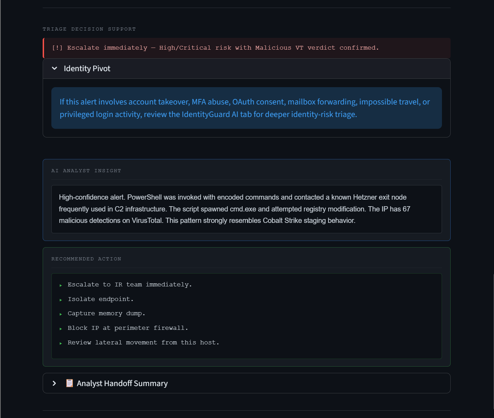
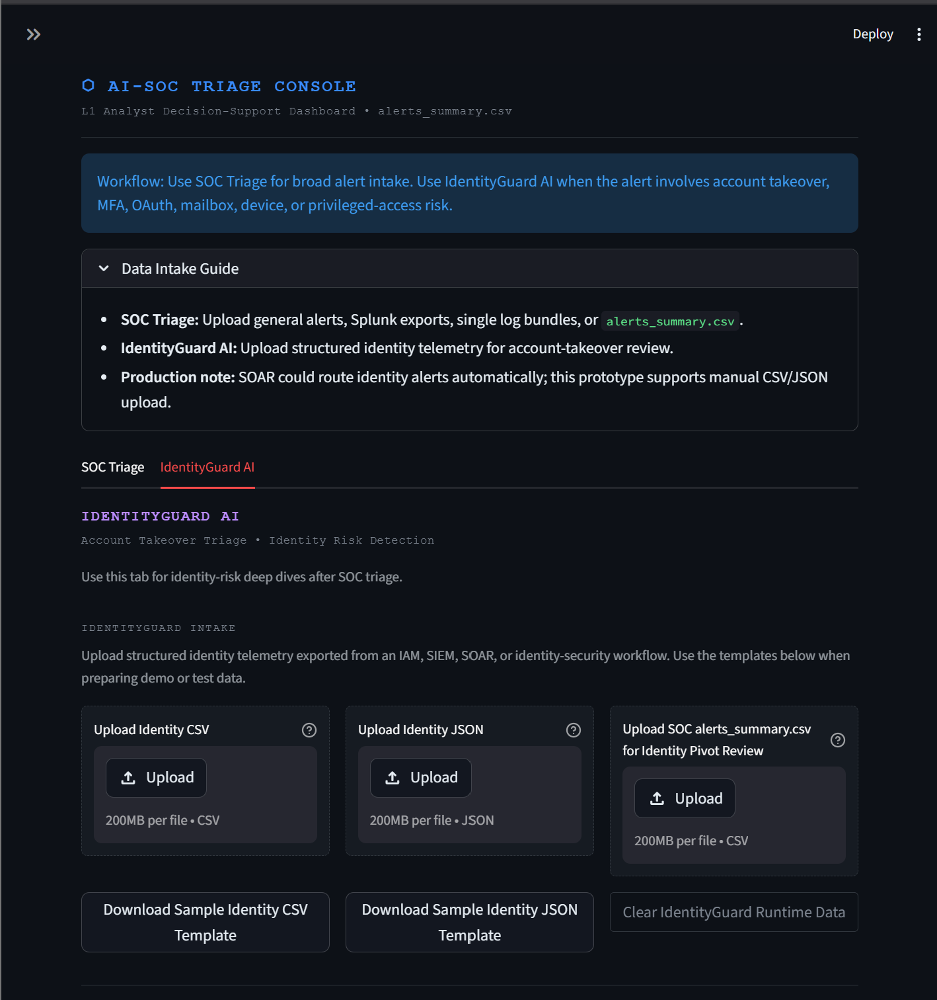
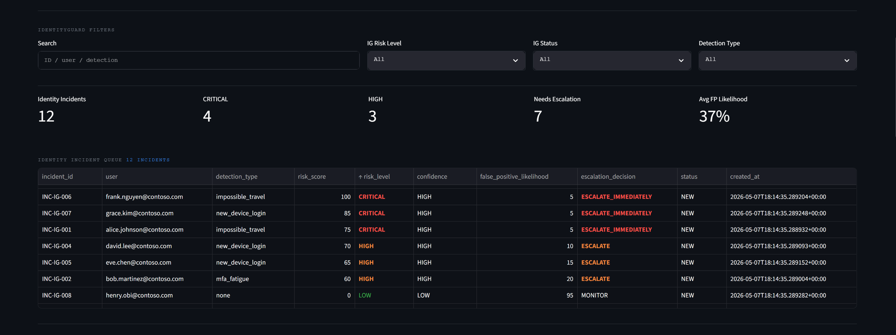
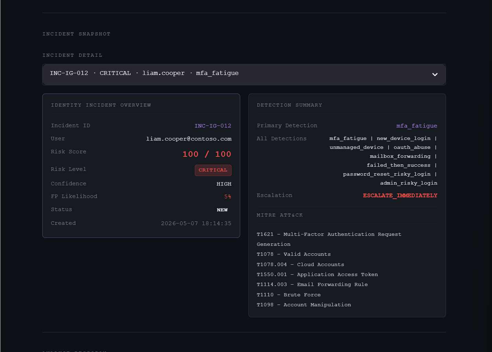
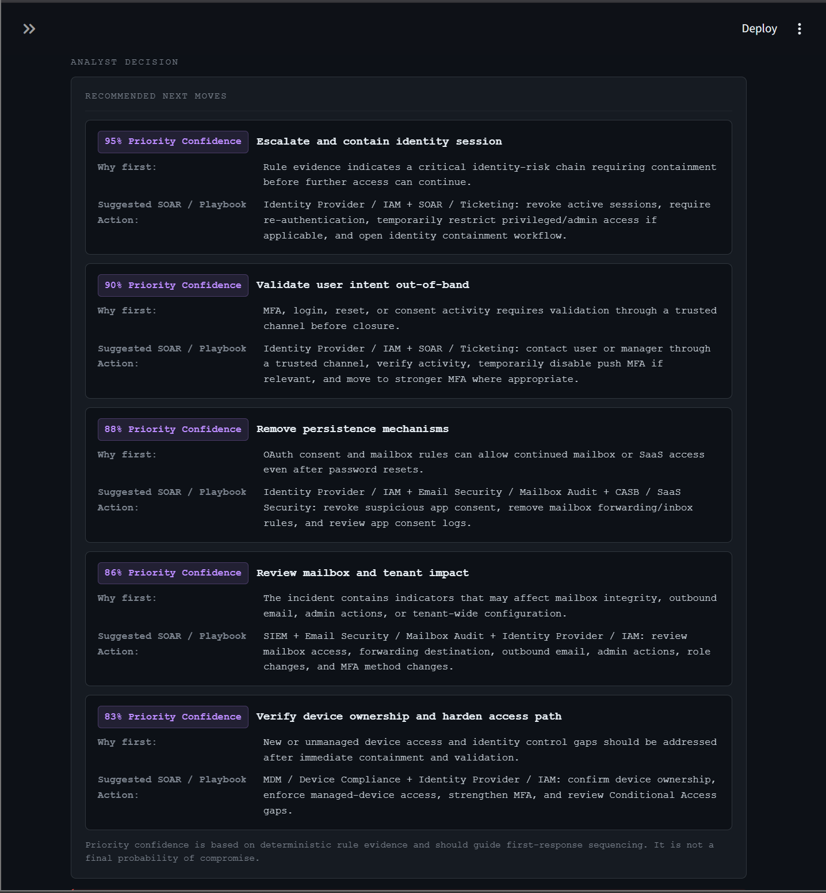
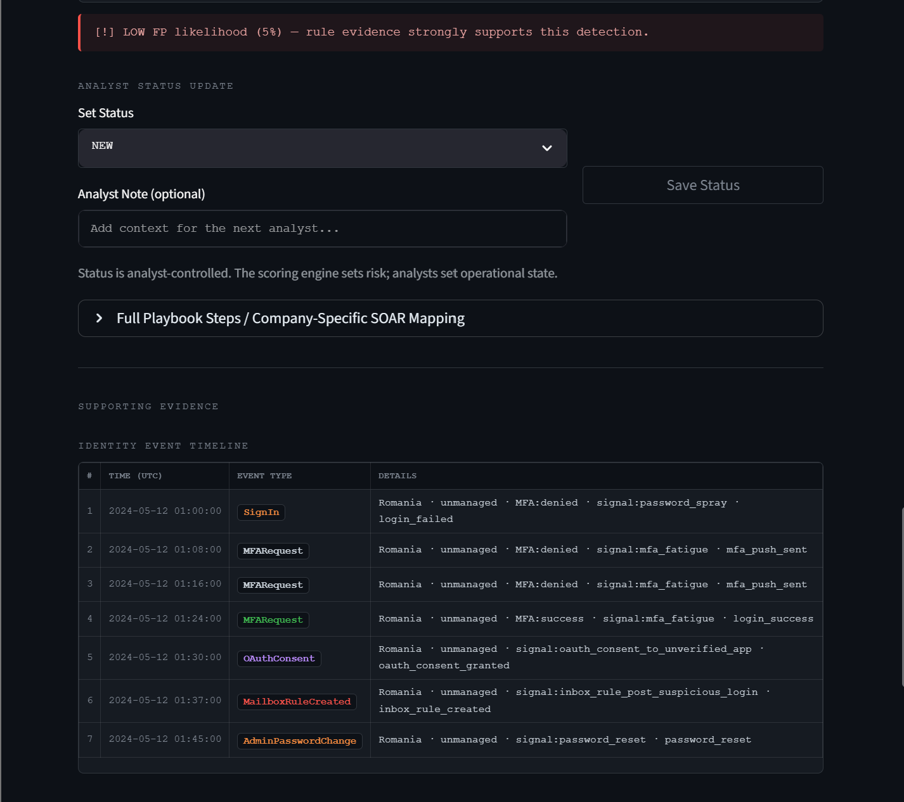
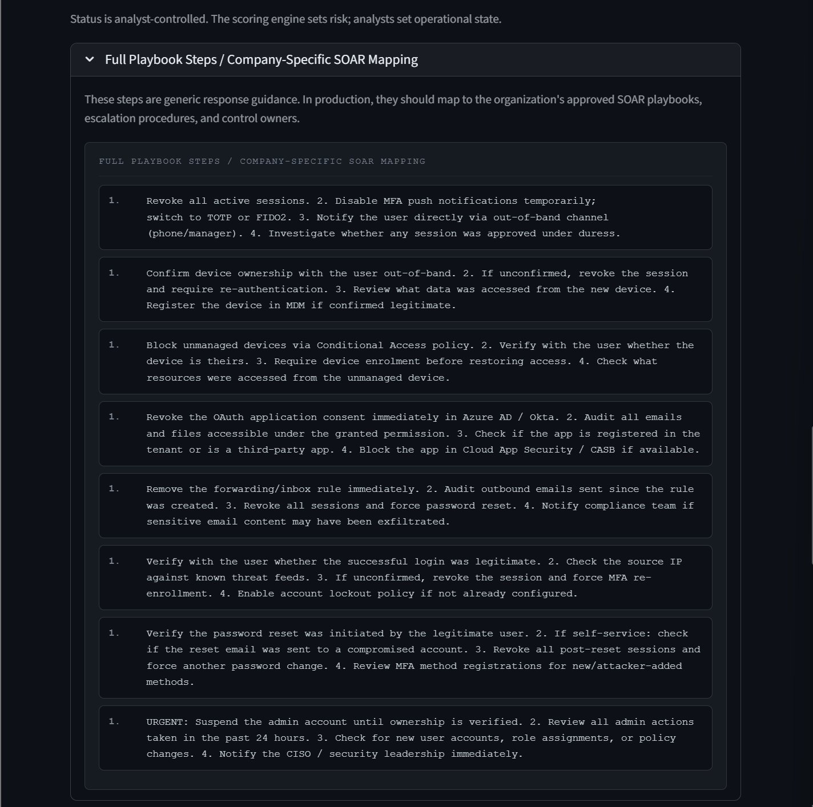
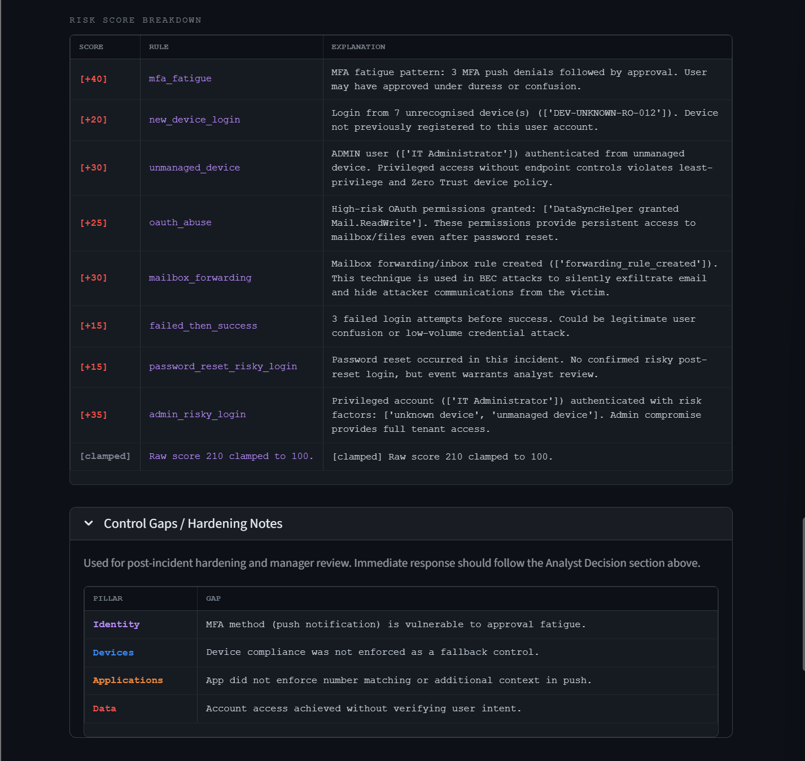
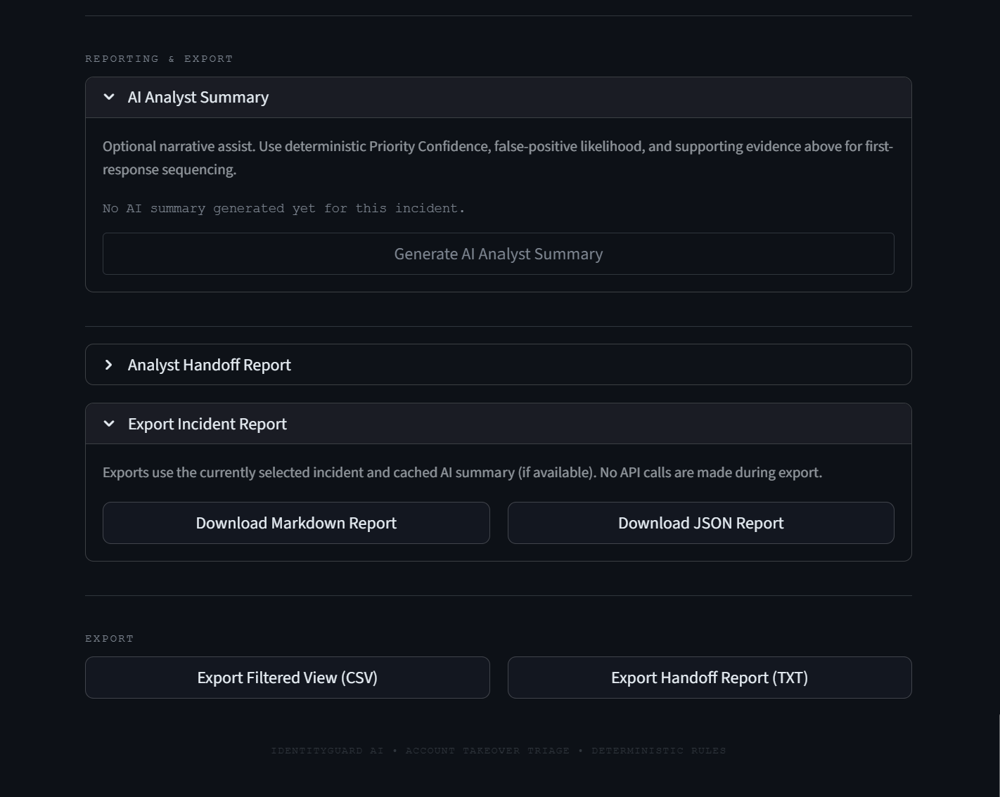
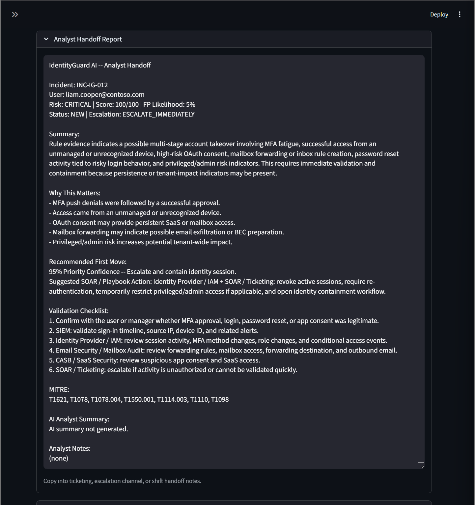

# AI-SOC Triage Console
AI-Powered SOC Decision-Support Dashboard with IdentityGuard AI

> A cybersecurity portfolio project that models an analyst-guided SOC triage workflow across broad alert intake, AI-assisted analysis, enrichment, MITRE ATT&CK mapping, and identity-risk investigation.

---

## Project Summary

**AI-SOC Triage Console** simulates a practical SOC analyst workflow for reviewing alerts, logs, and exported SIEM/EDR data. It ingests security events, performs AI-assisted triage, enriches indicators, maps activity to MITRE ATT&CK, and presents analyst-ready output in a Streamlit dashboard.

The upgraded project now includes **IdentityGuard AI**, a focused identity/account-takeover triage module for MFA fatigue, suspicious sign-ins, OAuth consent abuse, mailbox forwarding, unmanaged device access, password reset risk, and privileged account activity.

The goal is to reduce alert fatigue, speed up L1/L2 triage, and support better true-positive/false-positive decisions. This is a decision-support prototype, not a production SOAR replacement.

---

## Problem This Project Solves

SOC analysts are often overloaded with alerts that lack enough context for fast decisions. L1 analysts need a structured way to move from raw alert data to a clear investigation path without losing sight of false-positive risk.

Identity alerts are especially difficult because a single event rarely tells the full story. MFA prompts, OAuth consent, device posture, mailbox rules, password resets, travel context, and user intent all affect whether an alert should be escalated or closed.

This project organizes those signals into an analyst workflow:

- Convert alert/log data into reviewable incidents
- Add risk, confidence, false-positive likelihood, and MITRE context
- Preserve analyst control over status and escalation decisions
- Provide suggested validation searches and handoff notes
- Add a dedicated identity-risk deep dive when account-takeover signals appear

---

## Analyst Workflow

### SOC Triage

```text
Upload alert/log/Splunk export
        ->
AI triage + enrichment
        ->
Review alert queue
        ->
Validate with suggested searches
        ->
Escalate / close / handoff
```

### IdentityGuard AI

```text
Upload identity CSV/JSON
        ->
Detect identity-risk patterns
        ->
Review Priority Confidence next moves
        ->
Validate true/false-positive evidence
        ->
Update analyst status
        ->
Export handoff/report
```

**SOC Triage** is the broad L1 alert triage layer.  
**IdentityGuard AI** is the focused identity/account-takeover deep-dive module.

---

## Dashboard Tabs

| Tab | Purpose | Best Used For |
|---|---|---|
| SOC Triage | Broad alert intake and L1 triage | SIEM/EDR alerts, Splunk exports, single log bundles, `alerts_summary.csv` |
| IdentityGuard AI | Identity-risk deep dive | MFA fatigue, OAuth abuse, mailbox forwarding, suspicious sign-ins, privileged account risk |

The dashboard also includes a compact **Data Intake Guide** explaining when to use SOC Triage versus IdentityGuard AI.

---

## Demo Screenshots

The screenshots below reflect the SOC dashboard workflow already included in this repository. IdentityGuard AI is implemented in the current dashboard code.

### SOC Dashboard Overview





### Slack Alert Output


### Terminal Triage Output


---

## SOC Triage Capabilities

The SOC Triage tab is designed for broad alert intake and L1 review.

| Capability | Description |
|---|---|
| Processed alert upload | Upload an existing `alerts_summary.csv` into the dashboard |
| Template download | Download a sample `alerts_summary.csv` template |
| Raw log triage | Upload a single `.txt` incident/log bundle for AI-assisted triage |
| Splunk export triage | Upload a Splunk alert export CSV for batch triage |
| AI-assisted analysis | Generate analyst-friendly incident summaries and recommended actions |
| MITRE ATT&CK mapping | Map activity to relevant ATT&CK techniques |
| Threat enrichment | Display IP enrichment and VirusTotal-style verdict fields |
| Risk support | Show risk level, confidence, and false-positive likelihood |
| Analyst status workflow | Update incident state from the dashboard |
| Suggested validation searches | Generate starting-point Splunk SPL searches |
| Analyst handoff | Produce copy-ready handoff summaries for tickets or shift notes |
| Export current view | Download the currently filtered alert view as CSV |

### SOC Analyst Sections

The SOC Triage tab includes:

- SOC Intake
- SOC Filters
- KPI strip
- Export Current View
- Alert Queue
- Incident Detail
- Analyst Status Update
- Triage Decision Support
- AI Analyst Insight
- Recommended Action
- Analyst Handoff Summary
- Suggested Splunk Validation Searches
- Analytics Overview
- Raw Alert Record

---
### IdentityGuard AI Dashboard Overview










## IdentityGuard AI Capabilities

IdentityGuard AI is a deterministic identity-risk module focused on account takeover and access-abuse investigations. It complements the general SOC Triage workflow by giving analysts a deeper view of identity telemetry and likely response sequencing.

| Capability | Description |
|---|---|
| Identity CSV upload | Upload structured identity telemetry events |
| Identity JSON upload | Upload structured identity incidents or flat event lists |
| Template downloads | Download sample Identity CSV and JSON templates |
| SOC pivot review | Upload `alerts_summary.csv` for limited identity-signal preview |
| MFA fatigue detection | Identify repeated MFA denials followed by approval |
| Suspicious sign-in review | Detect sign-in patterns involving risk signals and context changes |
| Impossible travel | Flag geographic travel patterns that require validation |
| New/unmanaged device risk | Highlight unknown or unmanaged device access |
| OAuth consent abuse | Detect high-risk consent and application access token concerns |
| Mailbox forwarding | Surface BEC-style persistence indicators |
| Password reset risk | Detect password reset activity tied to risky login behavior |
| Privileged/admin risk | Highlight administrative account activity with identity risk factors |
| Deterministic scoring | Score identity incidents with explainable rules |
| Priority Confidence | Rank recommended next moves for first-response sequencing |
| False-positive support | Show FP likelihood and validation guidance |
| Evidence timeline | Display identity event sequence for the selected incident |
| Risk breakdown | Show scoring reasons and rule contributions |
| Control gaps | Surface Zero Trust / hardening gaps for supporting evidence |
| Optional AI summary | Generate a button-gated narrative assist when an API key is configured |
| Handoff/reporting | Generate analyst handoff text and Markdown/JSON exports |

### IdentityGuard Dashboard Sections

The IdentityGuard AI tab includes:

- IdentityGuard Intake
- IdentityGuard Filters
- KPI cards
- Identity Incident Queue
- Incident Snapshot
- Analyst Decision
- Recommended Next Moves
- Analyst Status Update
- Full Playbook Steps / Company-Specific SOAR Mapping
- Supporting Evidence
- Identity Event Timeline
- Risk Score Breakdown
- Zero Trust Control Gaps
- Reporting & Export
- AI Analyst Summary
- Analyst Handoff Report
- Export Incident Report
- Export Filtered View
- Export Handoff Report

---

## Priority Confidence

**Priority Confidence** ranks recommended first-response actions based on deterministic rule evidence. It is not a final probability of compromise.

The purpose is to help analysts sequence response actions quickly while still validating against raw telemetry, user intent, device ownership, and business context.

Example IdentityGuard next moves:

| Priority Confidence | Recommended Next Move |
|---:|---|
| 95% | Escalate and contain identity session |
| 90% | Validate user intent out-of-band |
| 88% | Remove persistence mechanisms |
| 82% | Review mailbox and tenant impact |
| 75% | Harden access path after containment |

Priority Confidence is deterministic and based on fields such as detection type, all detections, risk level, risk score, false-positive likelihood, and escalation decision.

---

## False-Positive Review

The dashboard does not automatically declare compromise.

Instead, it provides:

- Risk level
- Confidence
- False-positive likelihood
- Supporting rule evidence
- Recommended validation steps
- Analyst-controlled status updates

Analysts remain responsible for validating user intent, business context, device ownership, telemetry, and whether activity was authorized. This helps reduce alert fatigue without over-escalating ambiguous activity.

---

## Project Architecture

| Component | Purpose |
|---|---|
| `dashboard.py` | Main Streamlit dashboard with SOC Triage and IdentityGuard tabs |
| `triage.py` | AI-assisted SOC triage engine |
| `enrichment.py` | Indicator/IP enrichment support |
| `virustotal.py` | VirusTotal-style reputation lookup fields |
| `csv_exporter.py` | SOC alert output/export handling |
| `splunk_export_ingest.py` | Converts Splunk exports into triage-ready incidents |
| `identityguard/identity_rules.py` | IdentityGuard deterministic detection rules |
| `identityguard/identity_scoring.py` | IdentityGuard risk scoring and triage result aggregation |
| `identityguard/identity_dashboard.py` | IdentityGuard Streamlit UI |
| `identityguard/identity_ai_prompt.py` | Optional AI summary prompt support |
| `identityguard/identity_report_writer.py` | Markdown/JSON identity incident report export |
| `identityguard/demo_identity_generator.py` | Builds sample identity incidents for testing/demo use |
| `identityguard/identity_csv_exporter.py` | Writes IdentityGuard triage results to CSV |
| `run_identity_triage.py` | IdentityGuard CLI verification/demo runner |

---

## Supported Inputs

| Input | Used By | Purpose |
|---|---|---|
| `alerts_summary.csv` | SOC Triage | Processed SOC dashboard alerts |
| Single `.txt` log bundle | SOC Triage | One incident/log bundle for AI triage |
| Splunk alert export CSV | SOC Triage | Exported Splunk alert rows for batch triage |
| Identity CSV | IdentityGuard AI | Structured identity telemetry events |
| Identity JSON | IdentityGuard AI | Structured identity incidents/events |
| `alerts_summary.csv` identity pivot review | IdentityGuard AI | Limited preview of identity-related SOC alerts |

### IdentityGuard Minimum Fields

IdentityGuard CSV/JSON uploads require:

- `incident_id`
- `user`
- `event_time`
- `event_type`

### IdentityGuard Optional Fields

IdentityGuard can also use:

- `user_role`
- `source_ip`
- `country`
- `city`
- `device_id`
- `device_trust_status`
- `device_os`
- `mfa_result`
- `mfa_method`
- `app_name`
- `action`
- `oauth_app_name`
- `oauth_permission`
- `mailbox_action`
- `risk_signal`
- `known_vpn`
- `impossible_travel_flag`
- `failed_login_count`
- `session_id`
- `notes`

Missing optional string fields default to blank, booleans default to `false`, and numeric fields default to `0`.

---

## Outputs

| Output | Purpose |
|---|---|
| `output/alerts_summary.csv` | SOC triage results used by the SOC dashboard |
| `output/identity_alerts.csv` | IdentityGuard triage results |
| Filtered dashboard CSV export | SOC reporting, ticket attachment, or shift handoff |
| IdentityGuard filtered CSV export | Identity incident queue export |
| IdentityGuard handoff TXT export | Copy-ready analyst handoff |
| IdentityGuard Markdown report | Selected incident report |
| IdentityGuard JSON report | Structured selected incident report |
| Optional Slack webhook message | High/critical alert notification when configured |

Runtime outputs are generated locally and should be reviewed before committing or sharing.

---

## How to Run

### Install Dependencies

```bash
pip install -r requirements.txt
```

### Optional Environment Variables

Create a `.env` file in the project root if you want live AI summaries, VirusTotal enrichment, or Slack webhook notifications:

```text
ANTHROPIC_API_KEY=your_api_key_here
VIRUSTOTAL_API_KEY=your_virustotal_key_here
SLACK_WEBHOOK_URL=your_slack_webhook_here
```

Do not commit `.env` or API keys.

### Verify IdentityGuard Demo Data

```bash
python run_identity_triage.py --verify
```

### Launch the Dashboard

```bash
python -m streamlit run dashboard.py
```

### Run Single Raw Log Triage

```bash
py triage.py --log sample_logs/example_log.txt --save --json
```

### Run Batch Mode

```bash
py triage.py --batch generated_logs/ --save --json
```

### Run Batch Mode with Prefix Filtering

```bash
py triage.py --batch generated_logs/ --prefix splunk_alert_ --save --json
```

### Run Single SIEM/UEBA JSON Alert

```bash
py alert_ingest.py --alert alerts/impossible_travel.json
```

### Run Batch SIEM/UEBA Ingestion

```bash
py alert_ingest.py --batch alerts/
```

---

## Splunk Export Demo Workflow

1. Run `python -m streamlit run dashboard.py`
2. Open the **SOC Triage** tab
3. In **SOC Intake**, upload a Splunk alert export CSV
4. Click **Run Splunk Export Triage**
5. Review generated alerts in the alert queue
6. Select an incident
7. Review incident overview, threat intelligence, AI insight, recommended action, handoff summary, and suggested Splunk validation searches
8. Update analyst status
9. Export the current dashboard view as CSV if needed

This workflow is designed for exported alert CSV files. It is not a live Splunk API integration.

---

## IdentityGuard Demo Workflow

1. Run `python run_identity_triage.py --verify`
2. Run `python -m streamlit run dashboard.py`
3. Open the **IdentityGuard AI** tab
4. Review **IdentityGuard Intake** and template downloads
5. Select `INC-IG-012` from the Identity Incident Queue
6. Review **Recommended Next Moves** and Priority Confidence
7. Review Supporting Evidence, including timeline and scoring breakdown
8. Open **Analyst Handoff Report**
9. Export Markdown or JSON incident report if needed

IdentityGuard AI can also accept structured Identity CSV or JSON files that match the documented event fields.

---

## Example AI Triage Output

```text
INCIDENT SUMMARY
----------------
Incident ID   : TRG-20240501-0042
Timestamp     : 2024-05-01 03:17:44 UTC
Source File   : example_log.txt
Risk Level    : HIGH
Confidence    : 82%
FP Likelihood : Low

MITRE ATT&CK  : T1110 - Brute Force

ASSESSMENT
----------
Log analysis identified a high-volume authentication failure sequence
originating from a single external IP across multiple internal accounts
within a compressed time window. The pattern is consistent with automated
credential stuffing or password spray activity.

RECOMMENDED ACTIONS
-------------------
1. Confirm whether the source IP is a known business partner or authorized
   scanner before escalating.
2. Check for any successful authentications from this IP during or after
   the failure window.
3. Review affected account activity for anomalous access or privilege use.
4. If unauthorized access is confirmed, initiate account lockout and
   credential reset procedures per SOC playbook.

INDICATOR CONTEXT
-----------------
Source IP      : 185.220.101.47
Country        : Germany
ASN            : AS20473 (The Constant Company)
Hosting        : Yes
Proxy          : No
VT Verdict     : Malicious (34/94 engines)
VT Reputation  : -75
```

---

## Detection and Triage Coverage

### SOC Triage Examples

| Scenario | Risk Support | MITRE Technique |
|---|---|---|
| Impossible travel / valid account anomaly | HIGH | T1078 |
| Abnormal login volume | HIGH | T1110 |
| Data exfiltration | CRITICAL | T1048 |
| Privileged account anomaly | CRITICAL | T1098 |
| Malware execution | CRITICAL | T1059 |
| Credential dumping | HIGH | T1003 |
| Ransomware-style encryption | CRITICAL | T1486 |
| Phishing activity | MEDIUM | T1566 |

### IdentityGuard Examples

| Identity Pattern | Investigation Focus |
|---|---|
| MFA fatigue | Validate user intent and MFA approval context |
| Impossible travel | Compare sign-in geography, timing, and business travel context |
| New/unmanaged device login | Verify ownership and device compliance |
| OAuth consent abuse | Review suspicious app consent and SaaS/mailbox access |
| Mailbox forwarding | Review forwarding rules, inbox rules, and outbound email |
| Password reset risk | Validate reset legitimacy and post-reset sessions |
| Privileged/admin account risk | Review role changes, admin actions, and tenant impact |

---

## Tech Stack

**Core**
- Python
- Streamlit
- CLI-based automation
- CSV and JSON processing

**AI**
- Claude / Anthropic API for optional AI-assisted triage and narrative summaries
- Button-gated AI analyst summaries in IdentityGuard
- Deterministic IdentityGuard scoring independent of AI output

**Threat Intelligence**
- VirusTotal API fields
- Public IP geolocation enrichment
- Hosting and proxy context

**Security Concepts**
- SOC triage workflow design
- MITRE ATT&CK mapping
- Threat intelligence enrichment
- Identity and access-abuse triage
- False-positive review
- Analyst handoff documentation

**Integrations / Formats**
- Splunk alert export CSV workflow
- Optional Slack webhook notifications
- Raw `.txt` logs
- JSON SIEM/UEBA alerts
- Structured identity CSV/JSON

---

## Why This Project Matters

Many AI-security demos focus on detection. This project focuses on the analyst workflow after an alert fires: triage, enrichment, validation, status management, and handoff.

The design reflects practical realities of SOC work:

- Alert volume is high and analyst time is limited
- False-positive discipline matters
- Identity investigations require more than a single login signal
- AI can assist with summarization and first-pass analysis, but human judgment drives operational decisions
- Handoff quality affects downstream incident response

For a portfolio, this project demonstrates more than a prompt wrapper. It shows workflow design, deterministic scoring, Streamlit dashboard development, enrichment logic, identity-risk modeling, file-based ingestion, exports, and practical analyst UX.

---

## Limitations

- **Portfolio/lab project.** This is not a production SOC platform and has not been validated in an enterprise environment.
- **Not a SIEM, SOAR, EDR, or ticketing replacement.** It does not replace existing detection, response, or case management systems.
- **AI output requires validation.** AI-generated summaries and recommended actions must be reviewed against raw telemetry and business context.
- **IdentityGuard scoring is deterministic but limited to modeled fields.** Better telemetry produces better triage context.
- **IdentityGuard SOC pivot review is limited.** Uploading `alerts_summary.csv` to IdentityGuard detects identity-related rows but does not convert broad SOC alerts into full identity telemetry.
- **Splunk CSV upload is not live ingestion.** The Splunk workflow is based on exported CSV files, not Splunk API polling.
- **Status workflow is local.** Analyst status updates are file-based, not a production case-management database.
- **Slack alerting is optional.** Webhook notifications require local configuration and should be treated as a demo integration.

---

## Future Enhancements

- Live Splunk API integration
- SOAR-style response playbook simulation
- Production-grade authentication and role separation
- Database-backed case/status persistence
- Expanded identity telemetry parsers
- Additional enrichment providers
- Detection engineering rule tuning workflow
- PDF report export
- False-positive learning loop
- Safer deployment packaging

---

## Author

**Angelo Pollari**  
Cybersecurity | SOC Operations | AI + Security Automation

[GitHub](https://github.com/angelopollari187-hub) | [LinkedIn](https://www.linkedin.com/in/angelojpollari/)
