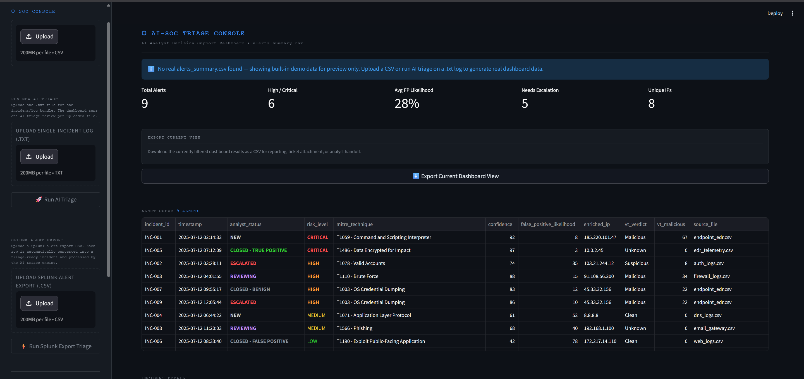
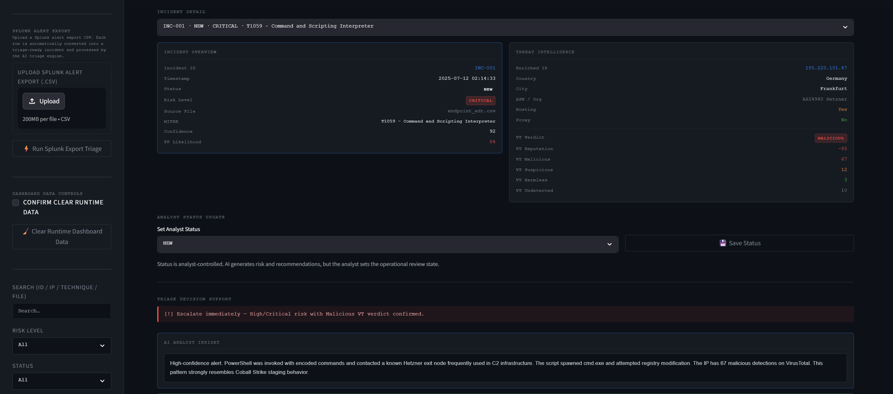
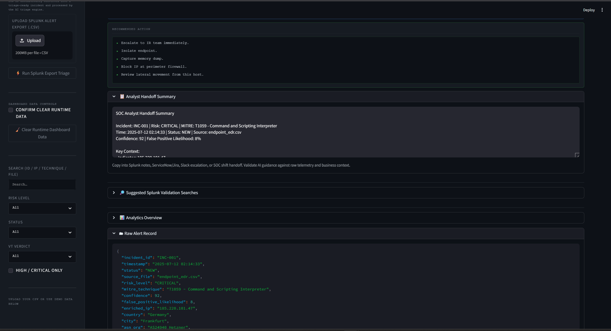
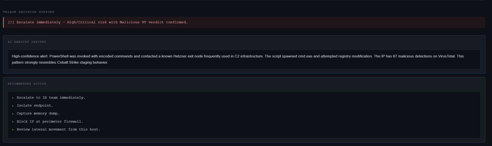
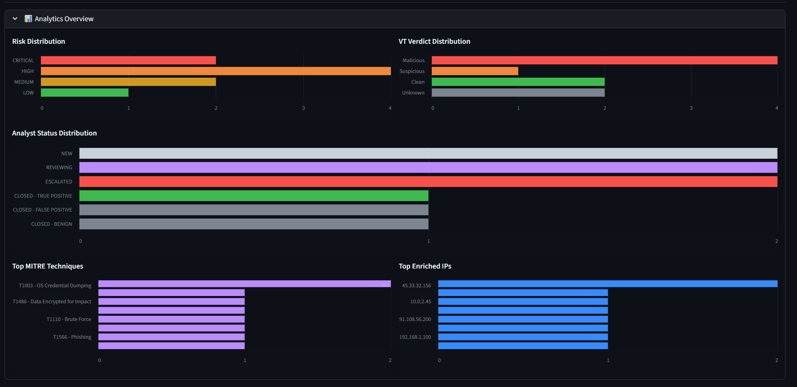
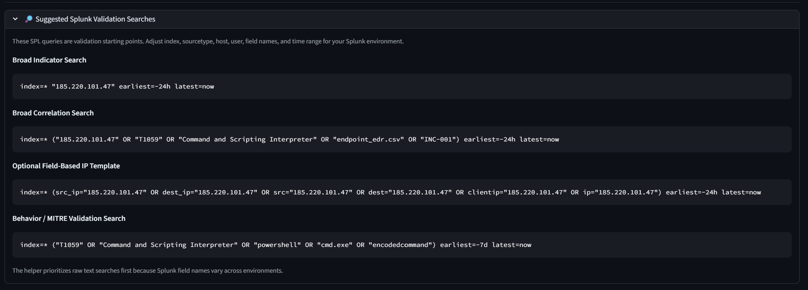
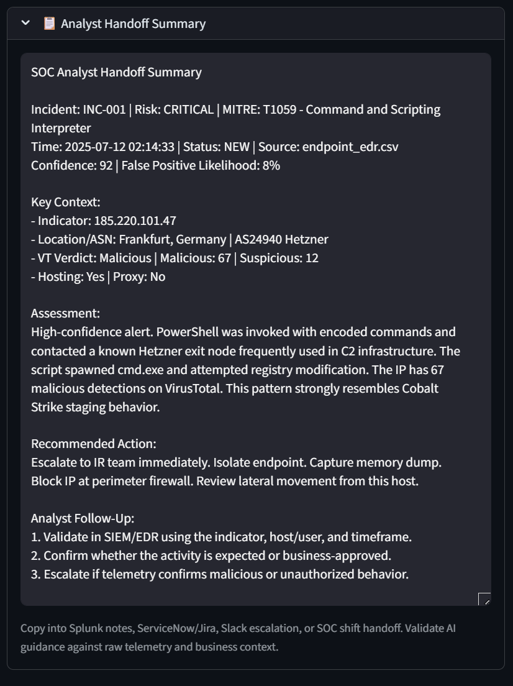

# AI-Powered SOC Triage System

> A Python-based SOC analyst decision-support tool for accelerating alert review, risk classification, and investigation handoff.

---

## Overview

**AI-SOC Triage** is a portfolio lab project that simulates a real-world SOC analyst workflow. It accepts raw security log files or Splunk alert export CSVs, runs AI-assisted triage via the Claude API, enriches indicators with threat intelligence, maps activity to MITRE ATT&CK, and presents results in a Streamlit dashboard built around L1 SOC workflows.

This tool is positioned as a **triage gateway** — it sits between alert sources and the analyst's existing SOC workflow. It does not replace a SIEM, SOAR, EDR, ticketing platform, or incident response process. AI generates risk classifications and recommended actions. The analyst controls all operational decisions.

---

## Triage Workflow

```
Splunk Alert Export CSV / Raw Log (.txt) / SIEM JSON Alert
                        ↓
              AI-SOC Triage Engine
                        ↓
       Risk Classification + MITRE ATT&CK Mapping
                        ↓
      Indicator Enrichment + VirusTotal Context
                        ↓
           SOC Dashboard Review (Streamlit)
                        ↓
     Analyst Status Update + Handoff Summary
                        ↓
  Splunk Validation Searches + Exportable Results
```

---

## Demo Screenshots

### SOC Dashboard Overview




### Analyst-Controlled Status Workflow


### Analytics Overview


### Suggested Splunk Validation Searches


### Analyst Handoff Summary


### Slack Alert Output


### Terminal Triage Output


---

## Core Features

### 1. AI-Powered Triage Engine

Processes raw `.txt` security logs, Splunk alert export CSVs, and structured JSON SIEM/UEBA alerts through the Claude API.

For each alert, the engine produces:

- An analyst-friendly incident summary in plain language
- Risk classification: `LOW`, `MEDIUM`, `HIGH`, or `CRITICAL`
- Confidence score and estimated false-positive likelihood
- MITRE ATT&CK technique mapping
- Recommended SOC validation and response actions

AI output is a starting point, not a verdict. All results require analyst review against raw logs and operational context.

---

### 2. Streamlit SOC Analyst Dashboard

A purpose-built analyst interface for reviewing triage output. The dashboard is organized around a standard L1 workflow.

**Alert Queue**
- Searchable and filterable alert list
- Filter by risk level, analyst status, and VirusTotal verdict
- Search by incident ID, IP address, MITRE technique, or source file

**Incident Detail Panel**
- Incident overview with timestamp, source, and risk classification
- Threat intelligence panel with enriched IP and VirusTotal context
- AI analyst insight and recommended action breakdown
- Analyst-controlled status update
- Suggested Splunk SPL validation searches
- Copy-ready analyst handoff summary

**Analytics Overview**
- Risk distribution
- VirusTotal verdict distribution
- Analyst status distribution
- Top MITRE techniques
- Top enriched IPs

**Export**
- Export the current dashboard view (with any active filters applied) as a CSV for tickets, handoff, or reporting

---

### 3. Direct Splunk Alert Export Triage

Analysts can upload a Splunk alert export CSV directly into the dashboard sidebar.

- Each row in the CSV is automatically converted into a triage-ready event
- AI triage runs on each row without manual file conversion
- Results appear in the alert queue alongside other incidents

This workflow is designed for exported alert CSV files. It is not a live Splunk API integration.

---

### 4. Analyst-Controlled Status Workflow

AI-generated alerts start as `NEW`. The analyst controls the operational review state from the dashboard.

**Supported statuses:**

| Status | Description |
|---|---|
| `NEW` | Alert has not been reviewed |
| `REVIEWING` | Analyst is actively investigating |
| `ESCALATED` | Alert has been escalated for further action |
| `CLOSED - TRUE POSITIVE` | Confirmed malicious activity |
| `CLOSED - FALSE POSITIVE` | Confirmed non-malicious, alert noise |
| `CLOSED - BENIGN` | Activity confirmed as expected behavior |

Status updates are reflected across the alert queue, status filter, incident overview, handoff summary, analytics overview, and exported CSV.

AI generates risk and recommendations. The analyst determines and records the final operational status.

---

### 5. Raw `.txt` Log Upload

The dashboard supports uploading a raw `.txt` log file for single-incident triage review.

- One uploaded file = one AI triage review
- The file is analyzed as a complete log bundle and appended to `output/alerts_summary.csv`
- Result appears in the alert queue

> **Note:** This feature is not designed to split a single large `.txt` file into multiple alert rows. For multi-incident batch processing, use separate `.txt` files per incident or run batch mode from the CLI.

---

### 6. MITRE ATT&CK Mapping

The triage engine maps detected behavior to relevant MITRE ATT&CK techniques, including:

- `T1078` — Valid Accounts
- `T1110` — Brute Force
- `T1048` — Exfiltration Over Alternative Protocol
- `T1098` — Account Manipulation
- `T1059` — Command and Scripting Interpreter
- `T1003` — OS Credential Dumping
- `T1486` — Data Encrypted for Impact
- `T1566` — Phishing

---

### 7. Threat Intelligence Enrichment

**Public IP enrichment** (via IP geolocation API):
- Country and city
- ASN / organization
- Hosting provider detection
- Proxy detection

**VirusTotal enrichment:**
- Verdict classification: `Malicious`, `Suspicious`, `Clean`, `Unknown`
- Malicious, suspicious, harmless, and undetected engine counts
- Reputation score

---

### 8. Analyst Handoff Summary

Each selected alert generates a copy-ready SOC handoff summary suitable for:

- Splunk analyst notes
- ServiceNow tickets
- Jira tickets
- Slack escalation messages
- SOC shift handoff documentation

**Summary includes:**
- Incident ID and timestamp
- Analyst status and risk level
- MITRE technique
- Confidence and false-positive likelihood
- Indicator context
- VirusTotal verdict
- AI assessment
- Recommended action and analyst follow-up steps

---

### 9. Suggested Splunk Validation Searches

For each selected alert, the dashboard generates suggested SPL searches as investigative starting points.

Search types may include:
- Broad indicator search
- Broad correlation search
- Optional field-based IP search template
- Behavior / MITRE validation search

> These searches are starting points. Analysts should adjust index names, sourcetypes, fields, hosts, users, and time ranges for their specific Splunk environment before running.

---

### 10. Export Current Dashboard View

The dashboard includes an export button that downloads the currently displayed alert set as a CSV.

Supports:
- Ticket attachments
- Analyst handoff documentation
- Reporting and evidence collection
- Filtered subset review

If a filter is active, only the filtered alerts are exported.

---

### 11. Slack Alerting

The system sends structured Slack notifications for `HIGH` and `CRITICAL` incidents via webhook.

**Each alert includes:**
- Incident metadata and risk level
- MITRE technique mapping
- Threat intelligence context
- Confidence and false-positive likelihood
- Recommended action

---

### 12. SIEM / UEBA Alert Ingestion

The project supports structured JSON-based simulated SIEM/UEBA alert ingestion for lab and portfolio demonstration scenarios.

---

## Detection Capabilities

| Scenario | Risk | MITRE Technique |
|---|---|---|
| Impossible travel | HIGH | T1078 |
| Abnormal login volume | HIGH | T1110 |
| Data exfiltration | CRITICAL | T1048 |
| Privileged account anomaly | CRITICAL | T1098 |
| Malware execution | CRITICAL | T1059 |
| Credential dumping | HIGH | T1003 |
| Ransomware-style encryption | CRITICAL | T1486 |
| Phishing activity | MEDIUM | T1566 |

---

## How to Run

### Clone the Repository

```bash
git clone https://github.com/angelopollari187-hub/ai-soc-triage.git
cd ai-soc-triage
```

### Install Dependencies

```bash
pip install -r requirements.txt
```

### Configure Environment Variables

Create a `.env` file in the project root:

```
ANTHROPIC_API_KEY=your_api_key_here
VIRUSTOTAL_API_KEY=your_virustotal_key_here
SLACK_WEBHOOK_URL=your_slack_webhook_here
```

### Run Single Raw Log Triage

```bash
py triage.py --log sample_logs/example_log.txt --save --json
```

### Run Batch Mode

```bash
py triage.py --batch generated_logs/ --save --json
```

### Run Batch Mode with Prefix Filtering

```bash
py triage.py --batch generated_logs/ --prefix splunk_alert_ --save --json
```

### Run Single SIEM/UEBA JSON Alert

```bash
py alert_ingest.py --alert alerts/impossible_travel.json
```

### Run Batch SIEM/UEBA Ingestion

```bash
py alert_ingest.py --batch alerts/
```

### Launch the Dashboard

```bash
python -m streamlit run dashboard.py
```

---

## Splunk Export Demo Workflow

1. Run `python -m streamlit run dashboard.py`
2. In the sidebar, upload a Splunk alert export CSV under the **Splunk Alert Export** section
3. Click **Run Splunk Export Triage**
4. Review the generated alerts in the alert queue
5. Select an incident
6. Review the incident overview, threat intelligence, AI insight, recommended action, analyst handoff summary, and suggested Splunk validation searches
7. Update the analyst status from the dropdown
8. Export the current dashboard view as a CSV

---

## Example AI Triage Output

```
INCIDENT SUMMARY
----------------
Incident ID   : TRG-20240501-0042
Timestamp     : 2024-05-01 03:17:44 UTC
Source File   : example_log.txt
Risk Level    : HIGH
Confidence    : 82%
FP Likelihood : Low

MITRE ATT&CK  : T1110 — Brute Force

ASSESSMENT
----------
Log analysis identified a high-volume authentication failure sequence
originating from a single external IP across multiple internal accounts
within a compressed time window. The pattern is consistent with automated
credential stuffing or password spray activity.

RECOMMENDED ACTIONS
-------------------
1. Confirm whether the source IP is a known business partner or authorized
   scanner before escalating.
2. Check for any successful authentications from this IP during or after
   the failure window.
3. Review affected account activity for anomalous access or privilege use.
4. If unauthorized access is confirmed, initiate account lockout and
   credential reset procedures per SOC playbook.

INDICATOR CONTEXT
-----------------
Source IP      : 185.220.101.47
Country        : Germany
ASN            : AS20473 (The Constant Company)
Hosting        : Yes
Proxy          : No
VT Verdict     : Malicious (34/94 engines)
VT Reputation  : -75
```

---

## Tech Stack

**Core**
- Python
- Streamlit
- CLI-based automation
- CSV and JSON processing

**AI**
- Claude / Anthropic API
- AI-assisted investigation summaries
- AI-generated risk classification
- AI-generated recommended actions

**Threat Intelligence**
- VirusTotal API
- Public IP geolocation enrichment
- Hosting and proxy context detection

**Security Concepts**
- SOC triage workflows
- MITRE ATT&CK mapping
- Threat intelligence enrichment
- Incident response decision support
- False-positive review logic

**Integrations**
- Slack webhooks
- Splunk alert export CSV workflow

**Data Formats**
- Raw `.txt` logs
- JSON SIEM/UEBA alerts
- Splunk export CSVs
- `alerts_summary.csv` (triage output)
- Exportable dashboard CSVs

**Dev Tools**
- Git / GitHub
- VS Code

---

## Why This Project Matters

Most AI-security demos focus on detection. This project focuses on the analyst workflow that follows — the triage, enrichment, validation, and handoff steps that happen after an alert fires.

The design reflects practical realities of L1 SOC work:

- Alert volume is high and analyst time is limited
- Not every alert warrants escalation — false-positive discipline matters
- AI can assist with initial classification and summary generation, but human judgment drives the operational decision
- Handoff quality directly affects how well an incident is handled downstream

The dashboard is built to support how analysts actually work: reviewing alerts in a queue, updating status as investigation progresses, generating handoff notes for tickets or shift changes, and exporting filtered results for reporting.

This is not a research prototype or a marketing demo. It is a functional decision-support tool built around a realistic SOC workflow.

---

## Limitations

- **Portfolio/lab project.** This is not a production SOC platform and has not been validated in an enterprise environment.
- **AI output requires validation.** Every AI-generated summary, risk classification, and recommendation must be reviewed against raw logs and operational context before acting on it.
- **Not a SIEM, SOAR, or EDR replacement.** The dashboard does not replace a SIEM, SOAR, EDR, ticketing platform, or incident response process.
- **Single-file `.txt` upload.** Raw log upload performs one AI triage review per uploaded file. It is not designed to split a single large file into multiple alert rows.
- **Splunk CSV upload is not live ingestion.** The Splunk upload feature is designed for exported alert CSV files. It does not connect to the Splunk API.
- **Analyst status is not a case management database.** Status updates are stored in the generated dashboard CSV workflow, not a production database or ticketing system.

---

## Future Enhancements

- Deployment-ready Docker containerization
- Live Splunk API integration
- Real-time log streaming
- SOAR-style response action simulation
- Detection engineering rule tuning workflow
- Analyst notes field per incident
- Exportable PDF handoff report
- AbuseIPDB enrichment integration
- Expanded threat intelligence sources
- False-positive learning model
- Authentication and user role separation

---

## Author

**Angelo Pollari**  
Cybersecurity | SOC Operations | AI + Security Automation

[GitHub](https://github.com/angelopollari187-hub) · [LinkedIn](https://www.linkedin.com/in/angelojpollari/)