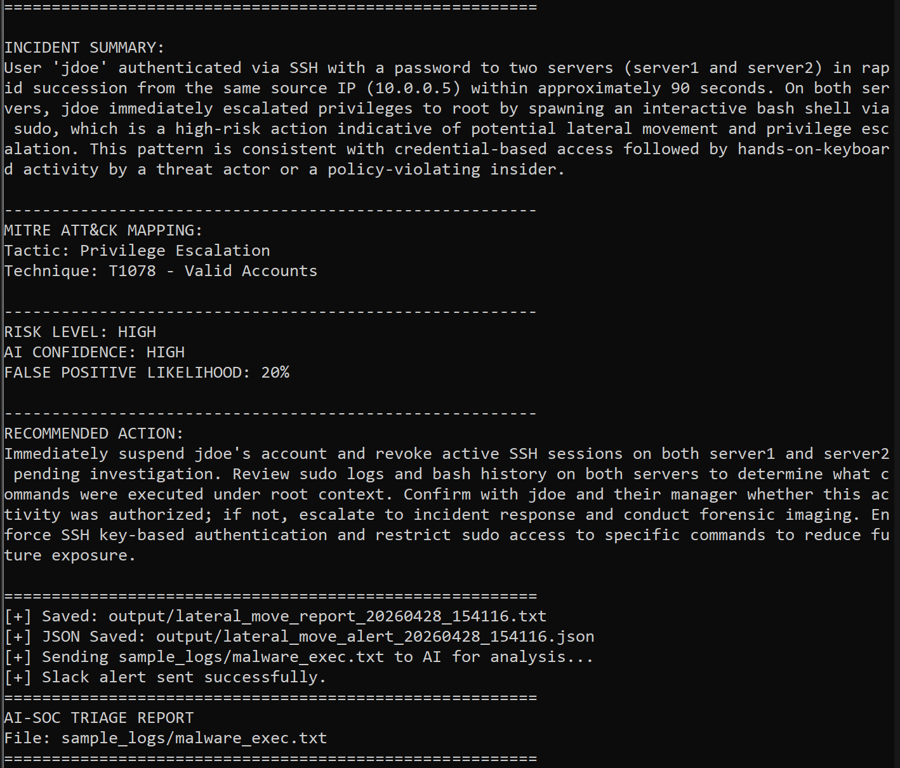
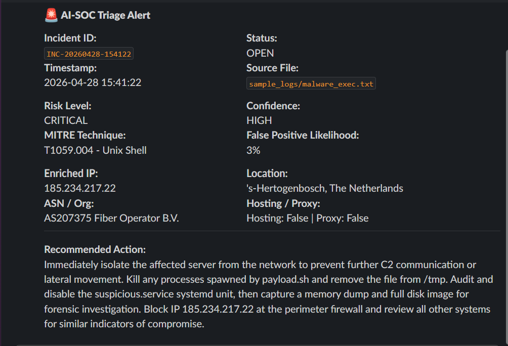
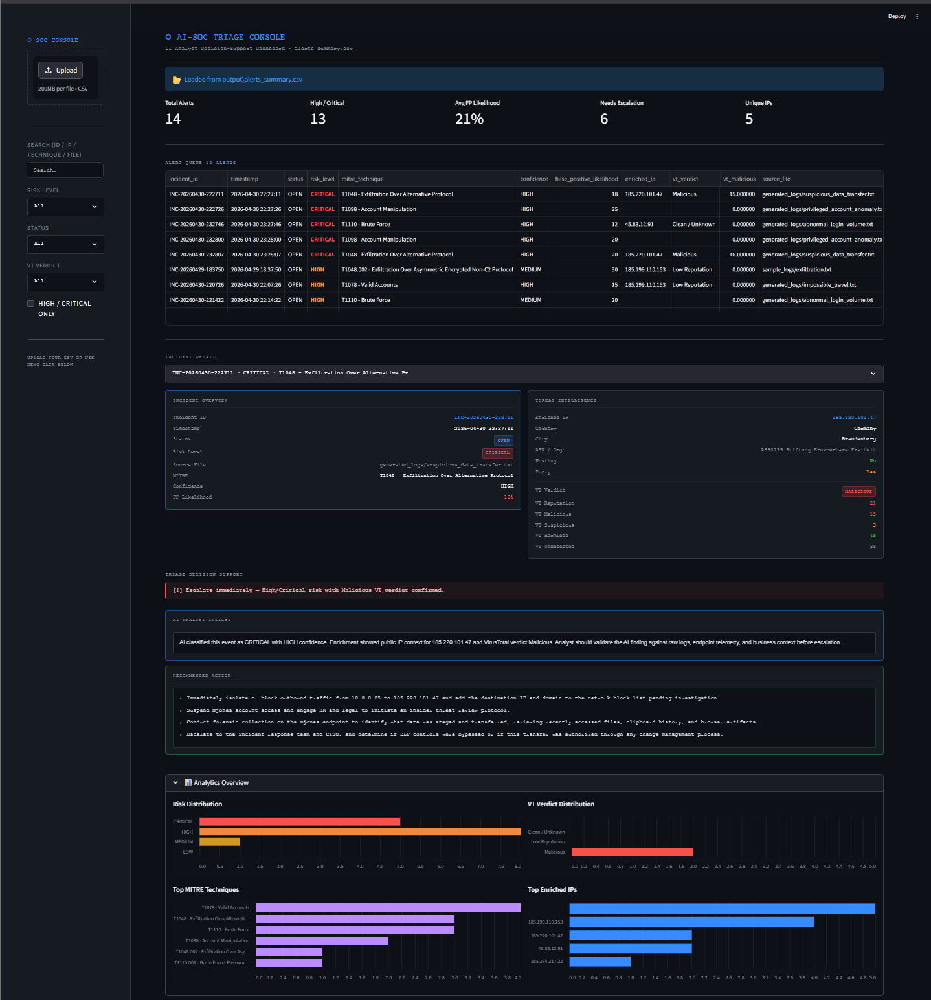

# 🛡️ AI-Powered SOC Triage System

An end-to-end **AI-assisted Security Operations Center (SOC) triage platform** that simulates real-world analyst workflows — from SIEM alert ingestion to investigation, enrichment, alerting, and dashboard-driven decision support.

---

## 🧭 System Architecture

```text
SIEM / UEBA Alert (JSON)
        ↓
Alert Ingestion & Normalization
        ↓
AI-Powered Triage (Claude)
        ↓
MITRE ATT&CK Mapping
        ↓
Threat Enrichment (IP + VirusTotal)
        ↓
Slack Alerting (SOC Simulation)
        ↓
CSV Case Tracking
        ↓
SOC Dashboard (L1 Decision Support)
```

---

## 🔎 SOC Triage Demo

### 🖥️ Terminal Analysis Output

### 🚨 Slack Alert Output

### 📊 SOC Dashboard



---

## 🚀 Core Features

### 🔍 AI-Powered Triage

* Analyzes logs using AI to generate:

  * Incident summaries
  * Risk classification
  * Confidence scoring
  * False positive likelihood
  * Recommended response actions

---

### 🧠 MITRE ATT&CK Mapping

* Dynamically maps alerts to MITRE techniques based on behavior
* Examples:

  * T1078 – Valid Accounts (Account takeover)
  * T1110 – Brute Force (Login abuse)
  * T1048 – Exfiltration (Data transfer)
  * T1098 – Account Manipulation (Privileged abuse)

---

### 🌐 Threat Intelligence Enrichment

* Public IP enrichment includes:

  * Country & city
  * ASN / organization
  * Hosting / proxy detection
* **VirusTotal integration**

  * Reputation scoring
  * Malicious / suspicious counts
  * Verdict classification

---

### 🔔 SOC Alerting (Slack Integration)

* Sends structured alerts for HIGH / CRITICAL incidents
* Includes:

  * Incident metadata
  * MITRE mapping
  * Threat intel
  * Recommended actions

---

### 📁 SIEM / UEBA Alert Ingestion

* Accepts structured alert JSON (Splunk-style simulation)
* Supports:

  * Impossible travel
  * Brute force / login abuse
  * Data exfiltration
  * Privileged account anomalies

---

### ⚙️ Batch Processing

```bash
py alert_ingest.py --batch alerts/
py triage.py --batch generated_logs/ --save --json
```

---

### 📊 SOC Dashboard (Streamlit)

Designed for **L1 analyst decision support**, not just visualization.

Includes:

* Alert queue (filterable + searchable)
* Risk & severity filtering
* Triage decision support hints
* Analyst insight summaries
* Threat intelligence panel
* Recommended action breakdown
* Expandable analytics (risk, MITRE, VT)

---

## 🧠 Analyst Insight Layer

Each alert includes:

* AI reasoning summary
* Confidence explanation
* Threat intel context
* Validation guidance

> Reinforces that AI **assists analysts — not replaces them**

---

## 💡 Why This Project Matters

This system simulates how modern SOC teams operate:

* Reduces alert fatigue through automated triage
* Prioritizes incidents using risk + confidence
* Maps behavior to MITRE ATT&CK
* Enriches alerts with external intelligence
* Produces structured, explainable investigations
* Accelerates L1 → L2 escalation decisions

---

## 🧪 Detection Capabilities

| Scenario                   | Risk     | MITRE |
| -------------------------- | -------- | ----- |
| Impossible travel          | HIGH     | T1078 |
| Abnormal login volume      | HIGH     | T1110 |
| Data exfiltration          | CRITICAL | T1048 |
| Privileged account anomaly | CRITICAL | T1098 |
| Malware execution          | CRITICAL | T1059 |

---

## 🔄 Full Workflow

### 1. Ingest SIEM Alert

```bash
py alert_ingest.py --alert alerts/impossible_travel.json
```

### 2. Run AI Triage

```bash
py triage.py --log generated_logs/impossible_travel.txt --save --json
```

### 3. Batch Mode

```bash
py alert_ingest.py --batch alerts/
py triage.py --batch generated_logs/ --save --json
```

### 4. Launch Dashboard

```bash
python -m streamlit run dashboard.py
```

---

## 📦 Example Output

```text
RISK LEVEL: HIGH
AI CONFIDENCE: HIGH
FALSE POSITIVE LIKELIHOOD: 15%

MITRE:
T1078 - Valid Accounts

RECOMMENDED ACTION:
Immediately suspend the account and verify activity with the user...
```

---

## 🛠️ Tech Stack

### Core

* Python
* CLI-based automation

### Security

* MITRE ATT&CK
* SOC triage workflows
* Threat modeling

### AI

* Claude (Anthropic API)
* AI-assisted investigation logic

### Threat Intelligence

* VirusTotal API
* IP enrichment

### Integrations

* Slack Webhooks

### Data

* JSON alerts
* CSV tracking
* Streamlit dashboard

### Dev Tools

* Git & GitHub
* VS Code

---

## 📌 Future Enhancements

* SOAR-style auto-response actions
* Splunk / SIEM API integration
* Real-time log streaming
* Detection engineering (rule tuning)
* False positive learning model

---

## 👤 Author

**Angelo Pollari**
Cybersecurity | SOC Operations | AI + Security Automation
